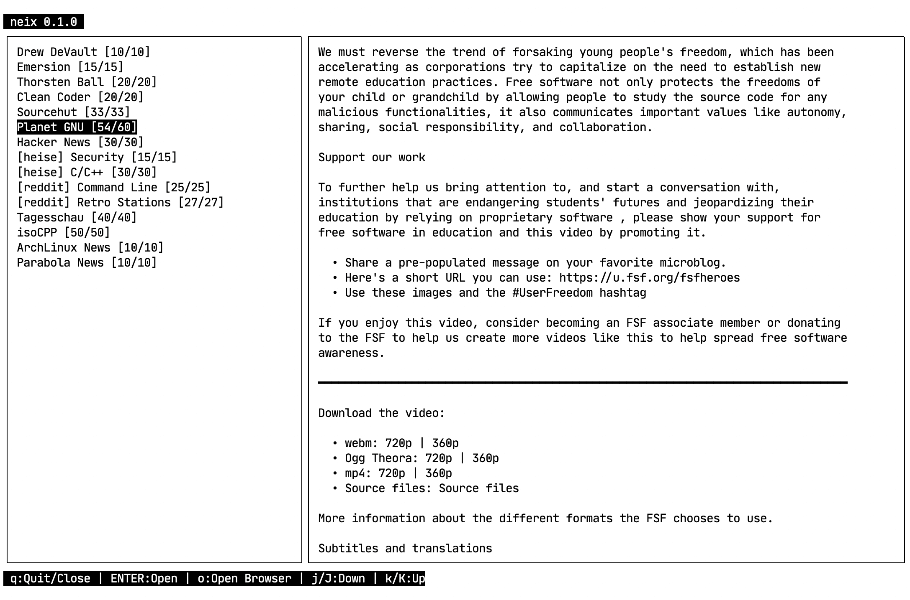
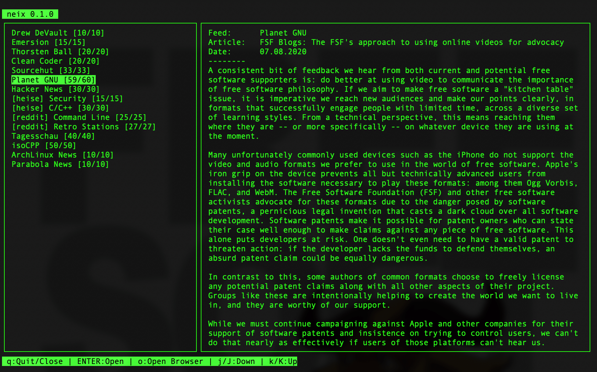

# neix - a news reader for your terminal
**neix** is a **work in progress** terminal feed reader for all common RSS/Atom feeds on the web out there.
It is free/libre software which protects your freedom. You got the full control of your news you want to read!  

## :page_facing_up: Table of Contents
- [Installation](#pager-installation)
- [Uninstall](#pager-uninstall)
- [Unit tests](#heavy_check_mark-unit-tests)
- [Usage](#clipboard-usage)
- [Configuration](#wrench-configuration)
	- [neix.conf](#nut_and_bolt-neixconf)
	- [feeds.conf](#nut_and_bolt-feedsconf)
- [Contributing](#memo-contributing)
- [TODO / Roadmap](https://github.com/tomschwarz/neix/blob/master/TODO.md)
- [Issues / Bugs](https://github.com/tomschwarz/neix/issues)
- [Libaries in usage](#books-libaries-in-usage)
- [License](#scroll-license)
- [Screenshots](#camera-screenshots)

## :pager: Installation
Follow the steps below for installing:  
```bash
$ git clone https://github.com/tomschwarz/neix.git  
$ cd neix  
$ cmake . # to enable unit-tests: cmake -DENABLE-TESTS=ON  
$ make  
$ sudo make install
```
After the successful installation you have to configure the **feeds.conf** file with the feeds you want to read.  
[Here](#nut_and_bolt-feedsconf) you can see the proper format.


## :pager: Uninstall
Follow the steps below for uninstalling:  
```bash
$ cd neix # should be the same directory where the repository was cloned into  
$ sudo make uninstall
```

If there is an error during the uninstall process or you don't have the directory anymore following the steps below:  
```bash
$ sudo updatedb  
$ locate neix # $ locate neix | grep /usr - if the output is to large  
$ sudo rm {PATH}/neix # where {PATH} is the full path to the binary  
```

## :heavy_check_mark: Unit tests
Follow the steps below for unit testing after the installation guide:  
```bash
$ ./bin/tests    
```
**Hint:** you have to be in the main directory of neix! 

To run only a specific test follow the steps below:  
```bash
$ ./bin/tests --gtest_filter=<TEST_CASE>
```

To list which tests are available follow the steps below:
```bash
$ ./bin/tests --gtest_list_tests
```

For more informations see [GoogleTest](https://github.com/google/googletest).

## :clipboard: Usage
```bash
$ neix
```
If **neix** is completely launched you got the following key's to navigate:  
| Key                             | Function                                                                                               | 
|---------------------------------|--------------------------------------------------------------------------------------------------------|
| <kbd>q</kbd>                    | Close the current opened article or quit **neix** when you on the not reading an article.              | 
| <kbd>ENTER</kbd>                | Open the selected article to read.                                                                     | 
| <kbd>o</kbd>                    | Open the current article in the browser (or with the programm you configured in the main config file). | 
| <kbd>j</kbd>                    | Select the next article in the current feed list.                                                      | 
| <kbd>k</kbd>                    | Select the previous article in the current feed list.                                                  | 
| <kbd>Shift</kbd> + <kbd>j</kbd> | Select the next feed of the loaded feed list.                                                          | 
| <kbd>Shift</kbd> + <kbd>k</kbd> | Select the previous feed of the loaded feed list.                                                      |

For more informations see the man-page:  
```bash
$ man neix
```

## :wrench: Configuration
Default directory of the config files: **~/.config/neix/**   
During the installtion process, **neix** create's the default directory with the needed configuration files.  

**neix** needs two configuration files. One for itself and one for the feeds which should be loaded.  
| File       | Description                                                                                |
|------------|--------------------------------------------------------------------------------------------|
| neix.conf  | This is the main configuration. It include's the date format, locale and the open command. |
| feeds.conf | This is the feed list. An entry represents a single news feed.                             |

### :nut_and_bolt: neix.conf
This is the main config file of **neix**.
| Option      | Value                                                                                                                                                                  |
|-------------|------------------------------------------------------------------------------------------------------------------------------------------------------------------------|
| dateFormat  | String which represents the format for the feed date. Here are all possible [formats](http://www.cplusplus.com/reference/iomanip/put_time/).                           |
| locale      | Here you can set the locale for your language ([see here](http://cplusplus.com/reference/clocale/setlocale/)). Run **locale -a** to see all locales you got installed. |
| openCommand | Here you can set which programm should be used to open the article link. Default is **xdg-open**. You can use what you want.                                           |
| renderText  | This option is optional. You can set here how the text should be formatted. Default is **w3m -dump -T text/html**. You can use **elinks** or others.                   |

### :nut_and_bolt: feeds.conf
This file contains the list of feeds you want to read.  
This is the required format of an single entry (every entry should be in a seperate line):  
```bash
TITLE = PROTOCOL://[username[:password]@]DOMAIN.TOP-LEVEL-DOMAIN   
```

## :memo: Contributing
If you want to contribute check the [CONTRIBUTING.md](https://github.com/tomschwarz/neix/blob/master/.github/CONTRIBUTING.md)

## :books: Libaries in usage
- [rapidXML](http://rapidxml.sourceforge.net/) is used for XML parsing
- [GoogleTest](https://github.com/google/googletest) is used for TDD

## :scroll: License
[GNU GPLv3](https://choosealicense.com/licenses/gpl-3.0/) © [Tom Schwarz](https://github.com/tomschwarz)

## :camera: Screenshots




