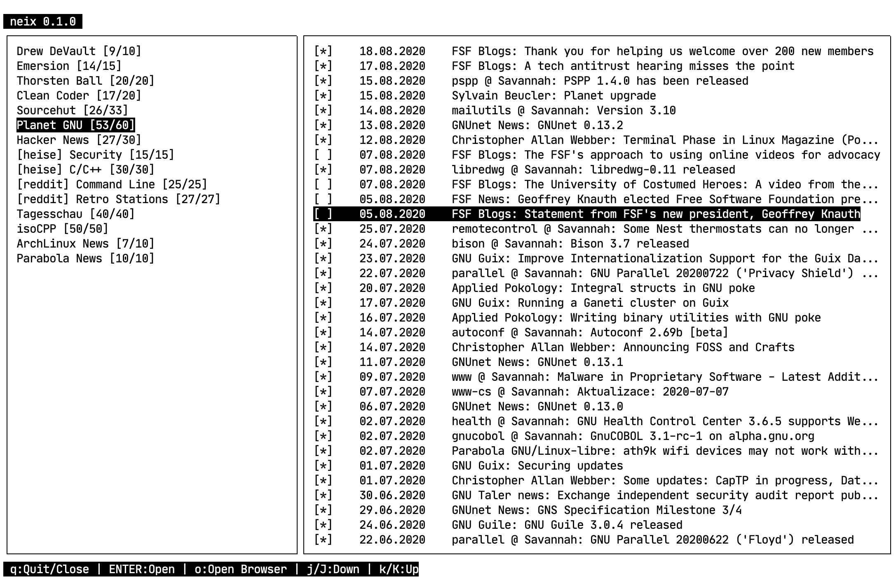
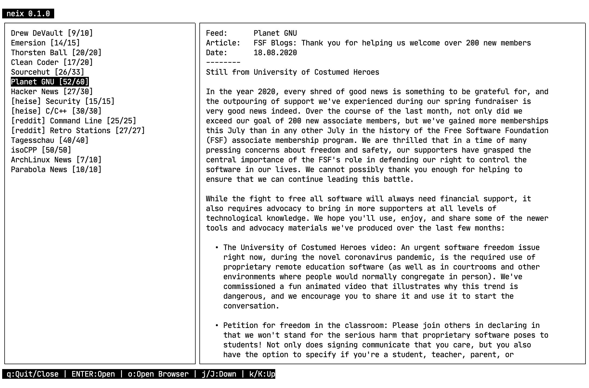

# neix - a news reader for your terminal


**neix** is a simple, **work in progress** terminal feed reader for all common RSS/Atom feeds on the web out there.
So you can read your news without advertisments or other annoying stuff. Just the informations you need. 
You can import your existing collection of feeds from an OPML file or just configure them manually. 
You also have the ability to render the text with w3m, elinks or which program you want. 
How to configure neix, take a look into the [configuration](#wrench-configuration) section.
You got the full control of your news you want to read! 


## :page_facing_up: Table of Contents
- [Installation](#pager-installation)
	- [Manual installation](#pager-manual-installation)
	- [Requirements](#bookmark_tabs-requirements)
	- [Packaging](#computer-packaging)
- [Uninstall](#pager-uninstall)
- [Unit tests](#heavy_check_mark-unit-tests)
- [Usage](#clipboard-usage)
    - [Command line options](#clipboard-command-line-options)
- [Configuration](#wrench-configuration)
	- [neix.conf](#nut_and_bolt-neixconf)
	- [feeds.conf](#nut_and_bolt-feedsconf)
- [Contributing](#memo-contributing)
- [TODO / Roadmap](https://github.com/tomschwarz/neix/blob/master/TODO.md)
- [Issues / Bugs](https://github.com/tomschwarz/neix/issues)
- [Libaries in usage](#books-libaries-in-usage)
- [License](#scroll-license)
- [Screenshots](#camera-screenshots)

## :pager: Installation
Before you can install **neix** make sure you have installed all [required](#bookmark_tabs-requirements) packages.  
After the successful installation you have to configure the **feeds.conf** 
file with the feeds you want to read.  
[Here](#nut_and_bolt-feedsconf) you can see the proper format.

### :pager: Manual installation 
Follow the steps below for installing:  
```bash
$ git clone https://github.com/tomschwarz/neix.git  
$ cd neix  
$ cmake . # to enable unit-tests: cmake -DENABLE-TESTS=ON  
$ make  
$ sudo make install
```

### :bookmark_tabs: Requirements
- [cmake (version 3.12 or newer)](https://cmake.org/download/)
- [libcurl (version 7.64.0 or newer)](http://curl.haxx.se/download.html)
- [ncurses (version 5 or newer)](https://invisible-island.net/ncurses/#downloads)

### :computer: Packaging
**neix** is available packaged for the following package manager/operating systems:  
- [AUR](https://aur.archlinux.org/packages/neix-git/)
- [zypper](https://build.opensuse.org/package/show/network:utilities/neix)

---

For some custom build packages or scripts see the [packages](https://github.com/tomschwarz/neix/wiki/Install-packages) section on the wiki.

## :pager: Uninstall
Follow the steps below for uninstalling:  
```bash
$ cd neix # should be the same directory where the repository was cloned into  
$ sudo make uninstall
```

If there is an error during the uninstall process or you don't have the 
directory anymore following the steps below:  
```bash
$ sudo updatedb  
$ locate neix # $ locate neix | grep /usr - if the output is to large  
$ sudo rm {PATH}/neix # where {PATH} is the full path to the binary  
```

## :heavy_check_mark: Unit tests
Follow the steps below for unit testing after the installation guide:  
```bash
$ ./bin/tests    
```
**Hint:** you have to be in the main directory of neix! 

To run only a specific test follow the steps below:  
```bash
$ ./bin/tests --gtest_filter=<TEST_CASE>
```

To list which tests are available follow the steps below:
```bash
$ ./bin/tests --gtest_list_tests
```

For more informations see [GoogleTest](https://github.com/google/googletest).

## :clipboard: Usage
```bash
$ neix
```
If **neix** is completely launched you got the following key's to navigate:  
| Key                             | Function                                                                                               | 
|---------------------------------|--------------------------------------------------------------------------------------------------------|
| <kbd>q</kbd>                    | Close the current opened article or quit **neix** when you on the not reading an article.              | 
| <kbd>ENTER</kbd>                | Open the selected article to read.                                                                     | 
| <kbd>o</kbd>                    | Open the current article in the browser (or with the programm you configured in the main config file). | 
| <kbd>j</kbd>                    | Select the next article in the current feed list.                                                      | 
| <kbd>k</kbd>                    | Select the previous article in the current feed list.                                                  | 
| <kbd>Shift</kbd> + <kbd>j</kbd> | Select the next feed of the loaded feed list.                                                          | 
| <kbd>Shift</kbd> + <kbd>k</kbd> | Select the previous feed of the loaded feed list.                                                      |

---

### :clipboard: Command line options
**neix** has some command line options you can use. 
See below the available options:

| Option        | Argument | Description                                                                                      |
|---------------|----------|--------------------------------------------------------------------------------------------------|
| <kbd>-v</kbd> | `-`      | Prints the installed version of **neix** and exits.                                              | 
| <kbd>-i</kbd> | `<path>` | Import feeds of given OPML file and exits. Path can be absolute or relative.                     |
| <kbd>-e</kbd> | `<path>` | Export feeds to given file or path. Creates an OPML 2.0 file. Path can be absolute or relative.  |

Usage of option `-v`:
```bash
$ neix -v
```

Usage of option `-i`:
```bash
$ neix -i ~/Downloads/import.xml
```

Usage of option `-e`:
```bash
$ neix -e ~/Downloads/export.xml
```

---

For more informations see the man-page:  
```bash
$ man neix
```

## :wrench: Configuration
Default directory of the config files: **~/.config/neix/**   
During the installtion process, **neix** create's the default directory with the needed configuration files.  

**neix** needs two configuration files. One for itself and one for the feeds which should be loaded.  
| File       | Description                                                                            |
|------------|----------------------------------------------------------------------------------------|
| neix.conf  | This is the main configuration. It include's the date format, locale and more options. |
| feeds.conf | This is the feed list. An entry represents a single news feed.                         |

### :nut_and_bolt: neix.conf
This is the main config file of **neix**.
| Option      | Value                                                                                                                                                                             |
|-------------|-----------------------------------------------------------------------------------------------------------------------------------------------------------------------------------|
| dateFormat  | String which represents the format for the feed date. Here are all possible [formats](http://www.cplusplus.com/reference/iomanip/put_time/). [REQUIRED]                           |
| locale      | Here you can set the locale for your language ([see here](http://cplusplus.com/reference/clocale/setlocale/)). Run **locale -a** to see all locales you got installed. [REQUIRED] |
| openCommand | Here you can set which programm should be used to open the article link. Default is **xdg-open**. You can use what you want. [REQUIRED]                                           |
| renderText  | You can set here how the text should be formatted. Default is **w3m -dump -T text/html**. You can use **elinks** or others. [OPTIONAL]                                            |

### :nut_and_bolt: feeds.conf
This file contains the list of feeds you want to read.  
This is the required format of an single entry (every entry should be in a seperate line):  
```bash
TITLE = PROTOCOL://[username[:password]@]DOMAIN.TOP-LEVEL-DOMAIN[/DIRECTORIES[/FILE]]   
```

## :memo: Contributing
If you want to contribute check the [CONTRIBUTING.md](https://github.com/tomschwarz/neix/blob/master/.github/CONTRIBUTING.md)  

## :books: Libaries in usage
- [rapidXML](http://rapidxml.sourceforge.net/) is used for XML parsing
- [GoogleTest](https://github.com/google/googletest) is used for TDD

## :scroll: License
[GNU GPLv3](https://choosealicense.com/licenses/gpl-3.0/) © [Tom Schwarz](https://github.com/tomschwarz)

## :camera: Screenshots




----

#### Free Software Foundation


I'm a member of the Free Software Foundation. Without GNU/Linux and all the great work from people all over the world producing free software, this project would not have been possible.

Consider joining the FSF, [here is why](https://my.fsf.org/join?referrer=5002414).

